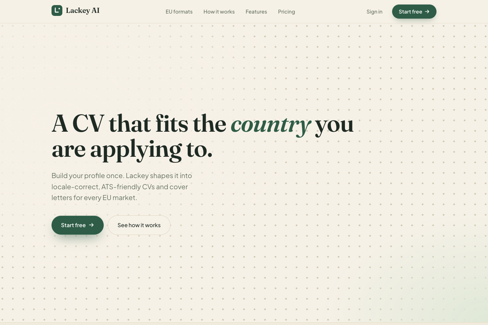
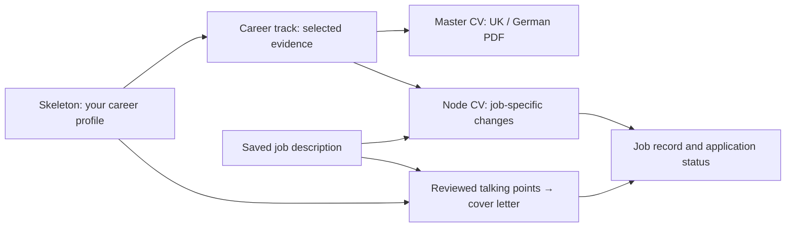
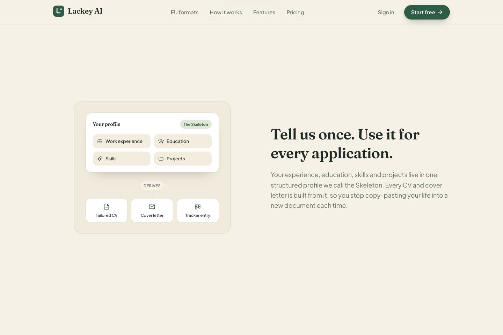
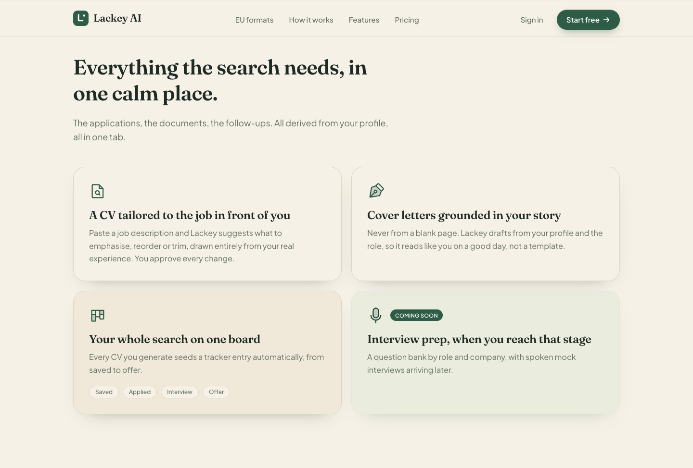
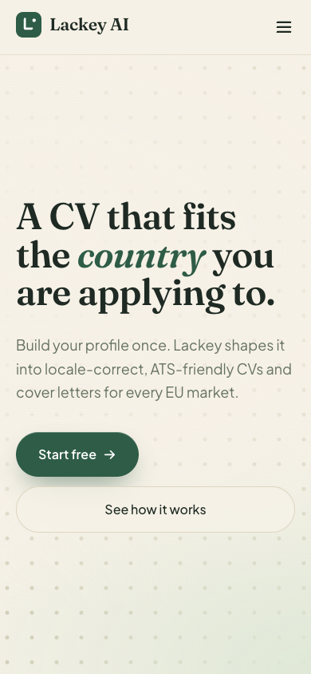
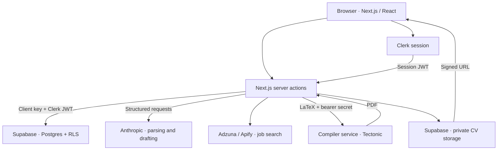

<div align="center">

# Lackey AI

**Build your profile once. Tailor every application.**

A workspace for job seekers: a reusable career profile, focused CVs, cover letters, job discovery, and an application tracker.

[Live preview](https://lackey-ai-main.vercel.app) · [Getting started](#getting-started) · [Architecture](#architecture) · [Development](#development)


</div>



## Why Lackey?

Applying for several roles usually means maintaining several versions of the same story. Lackey keeps your experience in one structured profile and builds each application from that source. Choose the experience that fits a career direction, tailor it to a job, review the suggestions, and keep the documents alongside your application status.

The project focuses on applications across Europe. The current PDF renderer implements **UK CVs and German Lebensläufe**. Additional formats shown on the landing page are part of the broader product vision.

## What you can do

| Feature | Current implementation |
| --- | --- |
| Reusable profile | Personal details, experience, education, projects, certifications, awards, publications, volunteering, tagged achievement bullets, skills, and languages. |
| Career tracks | Select and order relevant entries, skills, and bullets for a target role. Each track has its own title and summary. |
| Master CVs | Render a track as a UK or German CV and download a PDF compiled from LaTeX. |
| Job-specific CVs | Review AI suggestions to reorder, exclude, or rewrite selected material for a saved job, keeping the base profile intact. |
| Cover letters | Review proposed talking points tied to profile entries, generate a draft, edit it, save it, and copy the text. |
| Job discovery | Search Adzuna and HiringCafe through Apify, deduplicate results, and save jobs to your tracker. Sources need their own credentials. |
| Application tracking | Move jobs through **Saved → Prepared → Applied → Interviewing → Offer / Rejected**, with application dates and free-form notes for contacts or follow-ups. |

Job descriptions are currently supplied as **pasted text** or saved search results. CVs export as PDFs; cover letters are editable text. Interview preparation, spoken mock interviews, paid-plan enforcement, and Dutch, French, or Europass CV rendering are not implemented yet.

## One profile, several applications

Lackey uses three concepts to keep tailoring manageable:

- **Skeleton:** your canonical career profile and supporting evidence.
- **Career track:** a curated selection for a direction such as product management or software engineering, used to create a master CV.
- **Node CV:** a job-specific version built from a track, with overrides that leave the Skeleton unchanged.



For example, one profile can support both a product track and an engineering track. Each selects different achievements. Tailoring to a particular vacancy adds job-specific changes without forcing you to maintain a second source of truth.

## Screenshots

These are actual captures of the **public landing page**, including its product illustrations. They preview the visual design and product direction; they do not show an authenticated dashboard or verify every marketing claim. The feature table above describes the implemented scope.



<details>
<summary>Feature overview and mobile design</summary>





</details>

[Screenshot provenance](docs/screenshots/README.md)

## Getting started

### 1. Install the app

Use **Node.js 22.x (22.12 or later), or Node.js 24+**, and npm. You will also need Clerk and Supabase projects. AI, PDF compilation, and job search have additional credentials described below.

```bash
git clone https://github.com/maxatic/lackey-ai.git
cd lackey-ai
npm ci
cp .env.example .env.local
```

Fill in `.env.local` before starting the app. Placeholder Clerk keys are not usable credentials.

### 2. Connect authentication and the database

Lackey uses **Clerk for authentication** and **Supabase for Postgres and private file storage**.

1. Create a Clerk application and copy its publishable and secret keys into `.env.local`.
2. Create a Supabase project and set its URL and client key. The code reads the client key from `NEXT_PUBLIC_SUPABASE_ANON_KEY`.
3. Configure the native [Clerk integration with Supabase](https://supabase.com/docs/guides/auth/third-party/clerk): enable the integration in Clerk and add Clerk as a third-party auth provider in Supabase.
4. Set `DATABASE_URL` to a Postgres connection string from your Supabase project's connection settings. This is used by database scripts, not by normal dashboard requests.
5. Apply and verify the migrations:

```bash
npm run db:migrate
npm run db:verify
```

The migrations create the application tables, row-level security policies, and private `profile-photos` and `cvs` storage buckets. Applied migrations are recorded, so rerunning the migration command applies only pending files.

**New Supabase projects:** [tables now require explicit Data API grants](https://supabase.com/changelog/45329-breaking-change-tables-not-exposed-to-data-and-graphql-api-automatically). Migration `0002` grants access to the original tables, but the four tables added later rely on the older project defaults. After migrations, run this in your project's SQL Editor if those grants are absent:

```sql
grant select, insert, update, delete
on table public.cv_documents, public.job_descriptions,
         public.node_cvs, public.cover_letters
to authenticated;
```

These grants allow authenticated API requests to reach the tables; the existing RLS policies still limit access to the owning user's rows.

Supabase requests carry the current Clerk session token through the client's `accessToken` option. Ownership policies compare the JWT `sub` claim with each row's `user_id`. The dashboard uses the client key and ownership policies, so keep service-role credentials separate from normal application clients.

### 3. Start locally

```bash
npm run dev
```

Open [localhost:3000](http://localhost:3000), create an account, and visit `/dashboard`. Start with your profile, entries, skills, and languages, then create and curate a career track.

AI features require `ANTHROPIC_API_KEY`. PDF downloads require the compiler service. Job search uses whichever search providers you configure; an unavailable provider is reported without discarding results from another working source.

## Environment variables

The starting template is [`.env.example`](.env.example). Keep actual values in `.env.local` and your deployment's environment settings.

| Variables | Purpose |
| --- | --- |
| `NEXT_PUBLIC_CLERK_PUBLISHABLE_KEY`, `CLERK_SECRET_KEY` | Required for Clerk authentication. |
| `NEXT_PUBLIC_CLERK_SIGN_IN_URL`, `NEXT_PUBLIC_CLERK_SIGN_UP_URL` | Auth routes; the template uses `/sign-in` and `/sign-up`. |
| `NEXT_PUBLIC_SUPABASE_URL`, `NEXT_PUBLIC_SUPABASE_ANON_KEY` | Supabase project URL and client key for authenticated data and storage access. |
| `DATABASE_URL` | Postgres connection for migration, verification, and RLS test scripts. |
| `ANTHROPIC_API_KEY` | Job-description parsing, CV suggestions, talking points, and cover-letter drafting. |
| `COMPILE_SERVICE_URL`, `COMPILE_SERVICE_SECRET` | Base URL and shared bearer secret for the LaTeX-to-PDF service. |
| `ADZUNA_APP_ID`, `ADZUNA_APP_KEY` | Adzuna job search. Both are required for this source. |
| `APIFY_TOKEN` | HiringCafe search through the configured Apify actor. |
| `NEXT_PUBLIC_POSTHOG_KEY`, `NEXT_PUBLIC_POSTHOG_HOST`, `POSTHOG_API_KEY` | Optional client/server analytics; the template uses the EU PostHog host. |
| `SENTRY_DSN`, `NEXT_PUBLIC_SENTRY_DSN` | Optional server/client error reporting. |
| `SENTRY_ORG`, `SENTRY_PROJECT`, `SENTRY_AUTH_TOKEN` | Optional Sentry build configuration and source-map upload credentials. |

`SUPABASE_SERVICE_ROLE_KEY` remains in the template for administrative tooling; the current app clients do not use it. Variables without the `NEXT_PUBLIC_` prefix must remain server-side.

The AI model is configured in [`src/lib/ai/client.ts`](src/lib/ai/client.ts). Confirm that the configured model is available to your Anthropic account when enabling AI features.

## PDF compiler

The Next.js app renders LaTeX and sends it to a separate Node service running **Tectonic**. The compiler returns a PDF, which the app uploads to the private `cvs` bucket and exposes through a signed download URL valid for ten minutes.

To run the compiler locally, install Docker and use:

```bash
docker build --platform linux/amd64 -t lackey-cv-compiler compile-service
docker run --platform linux/amd64 --rm -p 8080:8080 \
  -e COMPILE_SERVICE_SECRET=local-development-secret \
  lackey-cv-compiler
```

The explicit platform matches the Tectonic binary bundled by the Dockerfile, including when building on Apple Silicon. In the app's `.env.local`, set:

```dotenv
COMPILE_SERVICE_URL=http://127.0.0.1:8080
COMPILE_SERVICE_SECRET=local-development-secret
```

Then, in another terminal:

```bash
COMPILE_SERVICE_SECRET=local-development-secret node compile-service/smoke.mjs
```

The service provides `GET /health` and an authenticated `POST /compile`. It accepts up to 256 KB of LaTeX; the app enforces a 30-second request timeout. See the [compiler guide](compile-service/README.md) and [Fly.io configuration](compile-service/fly.toml) for hosting details. Use a strong shared secret for a deployed service.

## Architecture



| Layer | Technology |
| --- | --- |
| Application | Next.js 15 App Router, React 19, TypeScript |
| Interface | Tailwind CSS 4, Phosphor icons, Fraunces and Plus Jakarta Sans typography |
| Landing-page motion | GSAP, ScrollTrigger, SplitText, and Lenis, with reduced-motion paths |
| Authentication | Clerk, protected dashboard routes, user bootstrap on dashboard entry |
| Persistence | Supabase Postgres, owner-scoped RLS, private storage buckets |
| AI | Anthropic SDK, structured tool schemas, output validation |
| PDF | Locale-specific LaTeX templates and a separate Tectonic compiler |
| Observability | Sentry and PostHog |
| Tests | Vitest, Testing Library, and a database-backed RLS isolation script |

AI suggestions are checked against existing profile identifiers, and the workflow lets users review CV changes and cover-letter talking points. Review the wording and factual accuracy before using generated documents. PDFs use a single-column layout with text rather than flattened page images; compatibility with a particular ATS still depends on that system.

## Repository map

```text
src/
├── app/
│   ├── (marketing)/       Public landing page
│   ├── dashboard/         Profile, tracks, jobs, search, tailoring, letters
│   ├── sign-in/           Clerk sign-in
│   └── sign-up/           Clerk sign-up
├── components/            Shared interface and marketing components
└── lib/
    ├── ai/                Anthropic client and structured response handling
    ├── auth/              Clerk-to-database user bootstrap
    ├── cv/                CV data, overrides, LaTeX locales, compilation
    ├── db/                Data access and ownership checks
    ├── jd/                Job-description parsing
    ├── letter/            Talking points and cover-letter generation
    ├── search/            Adzuna / HiringCafe adapters and deduplication
    └── supabase/          Clerk-token-aware database clients
supabase/migrations/       Schema, RLS, storage, and job pipeline migrations
scripts/                   Database migration, verification, and isolation tests
compile-service/           Dockerized LaTeX-to-PDF service
docs/                      Setup notes, handoff, design specs, and screenshots
```

The main workspace routes are `/dashboard/profile`, `/dashboard/entries`, `/dashboard/skills`, `/dashboard/languages`, `/dashboard/tracks`, `/dashboard/jobs`, and `/dashboard/search`. Individual track and job pages contain curation, CV generation, tailoring, and letter workflows.

## Development

| Command | What it does |
| --- | --- |
| `npm run dev` | Start the Next.js development server. |
| `npm run build` | Build the production app with the configured environment. |
| `npm start` | Serve the production build. |
| `npm run lint` | Run ESLint. |
| `npm test` | Run the Vitest suite. |
| `npm run db:migrate` | Apply pending SQL migrations using `.env.local`. |
| `npm run db:verify` | Check expected tables, RLS, and selected schema/storage details. |
| `npm run test:rls` | Exercise ownership isolation as two test users in a rolled-back transaction. |

Unit tests cover database helpers, server actions, search adapters, AI response validation, CV rendering, compilation, and selected interface behavior. The database commands use the database identified by `DATABASE_URL`; run the RLS integration check against a development project.

For deployment, configure the app environment on your Next.js host, apply the database migrations, and deploy the compiler separately. The repository includes Vercel-oriented setup notes and a Fly.io compiler configuration. Clerk, Supabase, Anthropic, search providers, and the compiler must be configured independently; the public landing page alone does not establish that all dashboard integrations are ready.

## Further reading

- [Setup notes](docs/SETUP.md) — detailed infrastructure walkthrough.
- [Project handoff](docs/HANDOFF.md) — dated implementation status and outstanding work.
- [Design specifications](docs/superpowers/specs) — feature decisions and data models.
- [Implementation plans](docs/superpowers/plans) — development history by feature.
- [Compiler service](compile-service/README.md) — deployment and service endpoints.

When adding a feature, keep profile data ownership explicit, preserve the Skeleton during job-specific tailoring, and add focused coverage for changed behavior.
